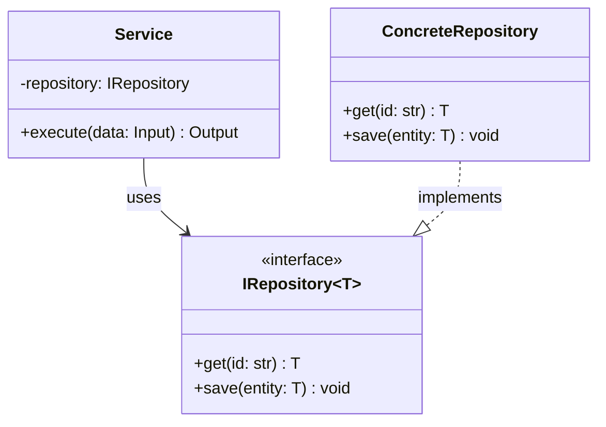
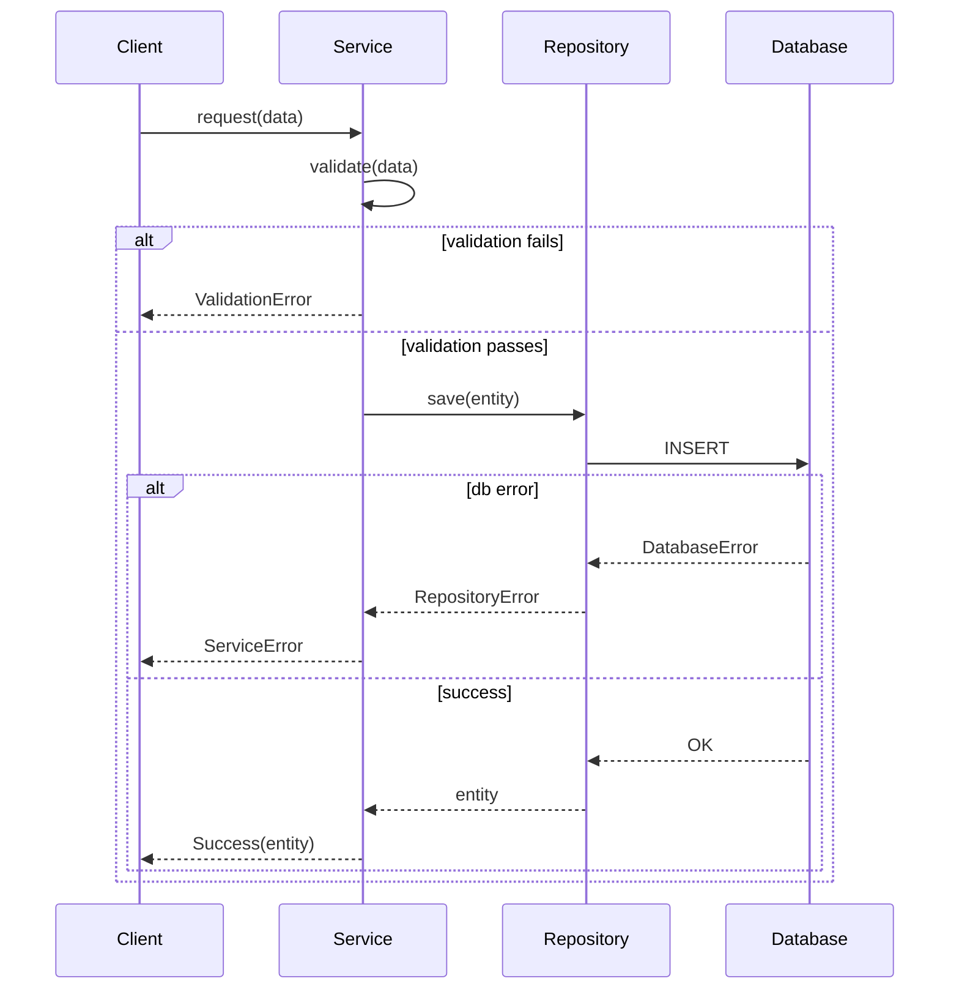
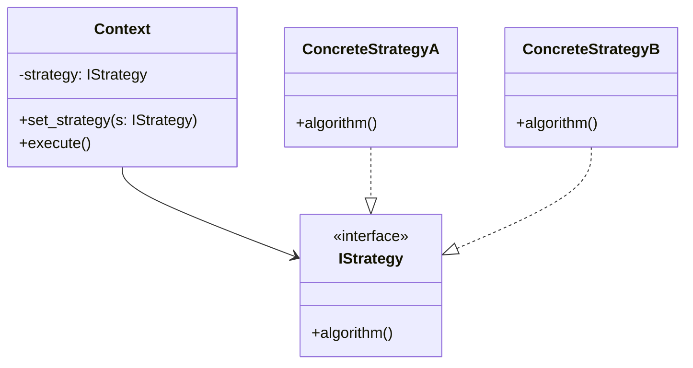
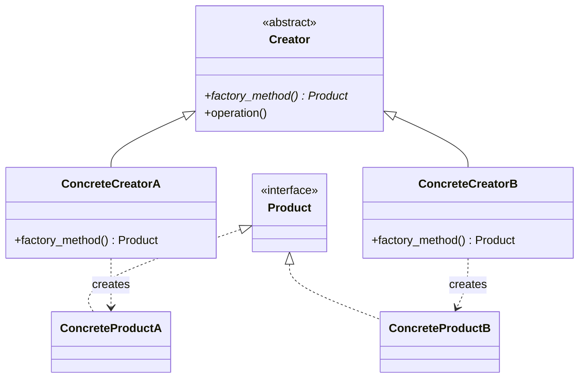
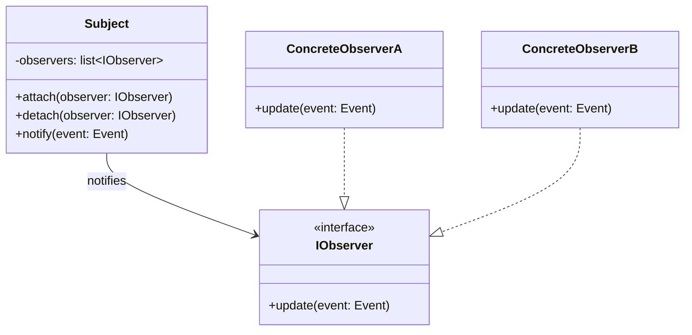

# Mermaid Diagram Templates

## Class Diagram - Service with Repository

## Sequence Diagram - Request with Error Handling

## Class Diagram - Strategy Pattern

## Class Diagram - Factory Method

## Class Diagram - Observer Pattern

